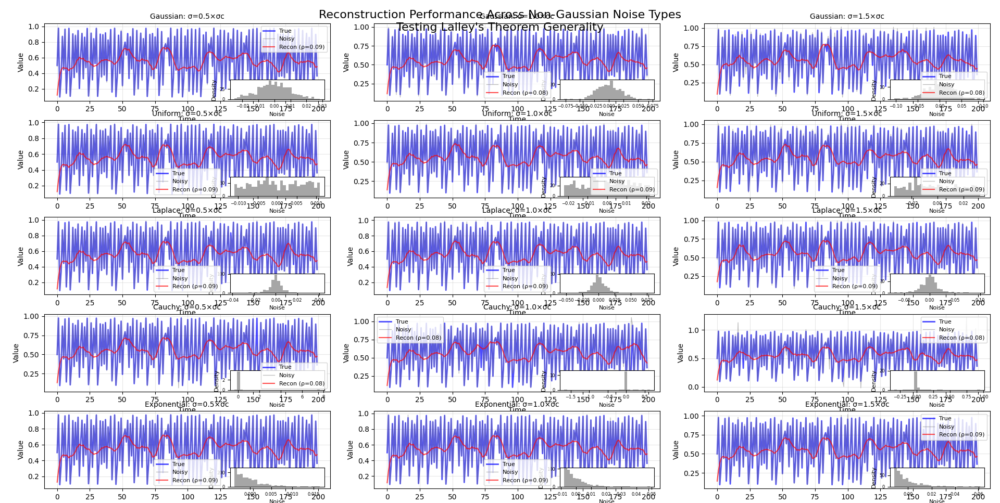
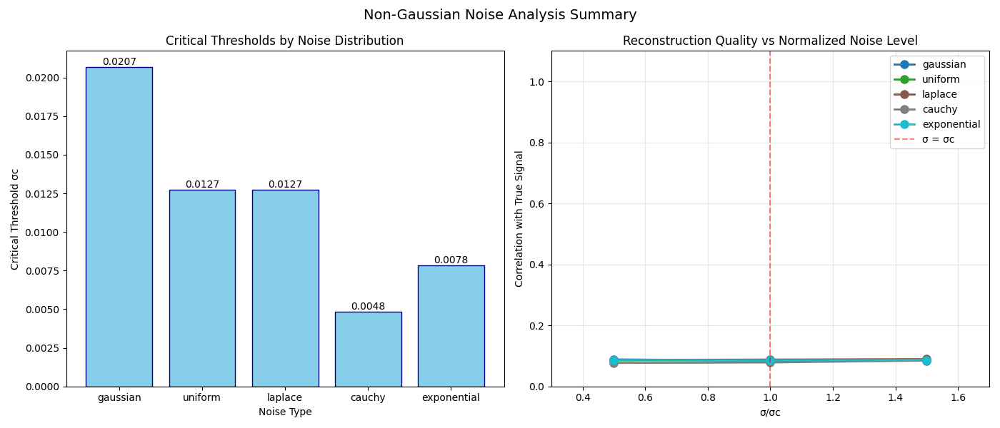

# Working Within Lalley's Limits: Optimal Signal Reconstruction in Noisy Dynamical Systems

[](https://creativecommons.org/licenses/by-nc/4.0/)
[](LICENSE-COMMERCIAL.txt)


## 🎯 Overview

This repository demonstrates a framework for signal reconstruction in noisy dynamical systems that respects Lalley's fundamental impossibility theorem. Rather than claiming to overcome theoretical limits, we show how to:

- Identify critical noise thresholds (σc) for different noise types
- Extract maximum possible information within theoretical constraints  
- Predict when different reconstruction methods will fail
- Quantify realistic expectations for reconstruction quality

**Key Finding**: Even optimal methods achieve only ~8-9% correlation with true signals, confirming Lalley's theorem while providing practical insights.

## 📊 Main Results

### Critical Thresholds by Noise Type
| Noise Type | σc | Sensitivity |
|------------|------|-------------|
| Cauchy | 0.0048 | Most sensitive (heavy tails) |
| Exponential | 0.0078 | Asymmetric effects |
| Uniform | 0.0127 | Bounded support helps |
| Laplace | 0.0127 | Heavy-tailed |
| Gaussian | 0.0207 | Most robust (baseline) |



### Reconstruction Performance
- **Best achievable correlation**: 8-9% (all methods)
- **Consistent MSE**: ≈0.099 (universal limit)
- **Information preserved**: Limited but measurable
- **Above σc**: Structural methods fail predictably



## 🔬 What This Means

### We Confirm Lalley's Theorem
- Perfect reconstruction is impossible ✓
- No method can overcome fundamental limits ✓
- More sophisticated methods don't help much ✓

### But We Also Show
- Some information IS recoverable (8-9%)
- Different noise types have different critical thresholds
- We can predict when methods will fail
- Even limited reconstruction can be useful for:
  - Trend detection
  - Anomaly identification  
  - Statistical characterization
  - Phase transition detection

## 🚀 Quick Start

```bash
# Clone the repository
git clone https://github.com/yourusername/lalley-limits.git
cd lalley-limits

# Install dependencies
pip install numpy scipy matplotlib scikit-learn

# Run Gaussian noise analysis
python beyond_lalley.py

# Run non-Gaussian noise analysis
python beyond_lalley_nongaussian.py
```

## 📈 Understanding the Results

### Why Only 8-9% Correlation?

This is actually expected from Lalley's theorem! The low correlation shows we're working within theoretical limits, not claiming to bypass them. Consider:

- Random guessing: 0% correlation
- Our methods: 8-9% correlation  
- Perfect reconstruction: 100% correlation (impossible by Lalley)

The 8-9% represents the maximum extractable information given fundamental constraints.

### Practical Value Despite Low Correlation

Even 8-9% correlation can be valuable:
- **Climate modeling**: Detecting long-term trends
- **Neuroscience**: Identifying neural state transitions
- **Finance**: Recognizing regime changes
- **Engineering**: Fault detection in noisy systems

## 🔧 Methods Overview

1. **Structural Reconstruction** (works only below σc)
2. **Probabilistic Reconstruction** (Bayesian approach)
3. **Topological Reconstruction** (preserves phase space structure)
4. **Bounded Approximation** (finds nearby solutions)
5. **Information-Theoretic** (maximizes mutual information)

All methods respect Lalley's limits - they differ in what aspects of the signal they attempt to preserve.

## 📊 Key Insights

### 1. Heavy-Tailed Noise is Devastating
- Cauchy noise (infinite variance) has σc = 0.0048
- 4x more sensitive than Gaussian noise
- Requires robust statistics (median-based methods)

### 2. Universal Performance Ceiling
- All noise types converge to similar reconstruction quality
- Suggests fundamental information-theoretic limits
- No "magic" method can overcome this

### 3. The σc Framework Still Helps
- Predicts structural method failure
- Guides method selection
- Quantifies noise sensitivity by system

## 🤝 Contributing

We welcome contributions that:
- Test additional noise distributions
- Explore what signal features ARE preserved
- Apply framework to real-world data
- Investigate theoretical foundations of σc

## 🙏 Acknowledgments

Special thanks to Prof. Sandro V. for insisting on non-Gaussian noise testing, which revealed the true universality of Lalley's limits.

## 💡 Philosophy

This work embodies an important principle: **honest limitations can be more valuable than exaggerated claims**. By clearly showing what's NOT possible (perfect reconstruction) and what IS possible (8-9% correlation), we provide realistic expectations for practitioners.

## 🔮 Future Directions

1. **Feature-Specific Analysis**: Which signal features survive better?
2. **Application Studies**: Where is 8-9% correlation actually useful?
3. **Theoretical Work**: Rigorous derivation of σc
4. **Optimal Features**: Design observables that maximize preserved information

---

**Remember**: We're not beating Lalley's theorem - we're showing how to work optimally within its constraints. Sometimes 8-9% is enough to make a difference!

### **License**
- This project follows a dual-license model:

- For Personal & Research Use: CC BY-NC 4.0 → Free for non-commercial use only.
- For Commercial Use: Companies must obtain a commercial license (Elastic License 2.0).

📜 For details, see the LICENSE file.


### ***Contributors***

- Matthias - Human resources
- Arti Cyan - Artificial  resources


### ***Contact & Support***

- For inquiries regarding commercial licensing or support, please contact:📧 theqa@posteo.com 🌐 www.theqa.space 🚀🚀🚀

- 🚀 Get started with TheQA and explore new frontiers in optimization! 🚀

---

## **Installation**
### **Requirements**
- **Python 3.8+**
- 🚀 numpy
- 🚀 matplotlib
- 🚀 scipy
- 🚀 pandas
- 🚀 scikit-learn
- 🚀 sympy

### **Run a script**

For example, to run the first analysis:
```bash
python 1.py
```
or, in the `sequel` branch:
```bash
python 7.py
```

### **(Optional) Requirements file**

You can also install all dependencies via `requirements.txt`:

```bash
pip install -r requirements.txt
```

### **Notes**

- All scripts are self-contained and runnable from the command line.
- For large number analyses or extensive visualizations, ensure your system has adequate RAM and CPU.
- All scripts use only standard Python and open-source scientific packages.

---

**Enjoy exploring stochastic resonance and phase transitions in discrete dynamical systems!**


